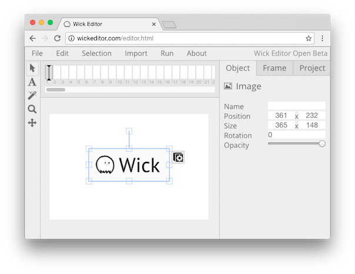

# Wick

Wick is an HTML5-based Flash-style editor and player for interactive media on the web.

Try the editor and see the demos [here](http://wickeditor.com/)!

### How to run the editor locally for development
* Clone or download and unzip this repo
* Open terminal in the newly made `wick` folder and start an HTTP server: `python -m SimpleHTTPServer`
* Open a browser window, and go to `http://localhost:8000/`

### How to contribute to Wick
We always need help with development - there's so much to do!
* Bug fixes are always appreciated. Check out the bugs on the [issue tracker](https://github.com/zrispo/wick/issues)
* If you have an idea for a specific feature, [tweet me @zrispo](https://twitter.com/zrispo) for big stuff or [make an issue](https://github.com/zrispo/wick/issues) for smaller stuff
